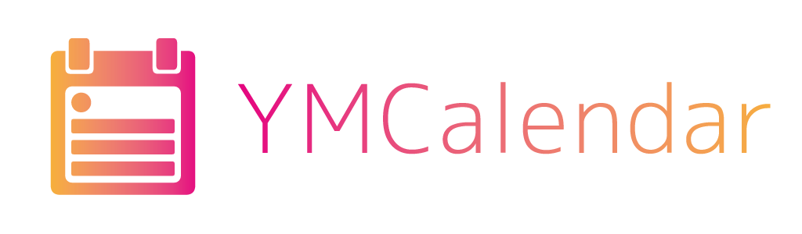
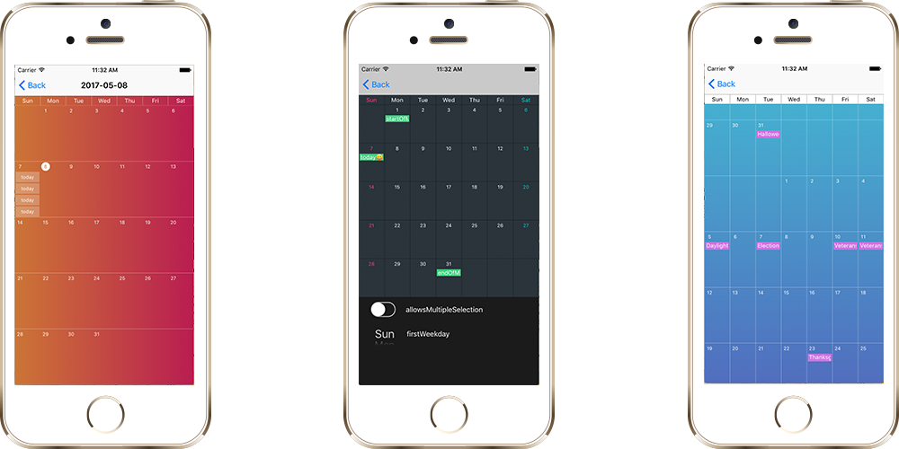
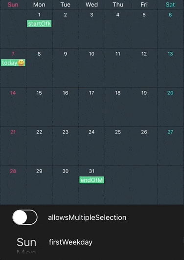

---

[](https://travis-ci.org/matsune/YMCalendar)
[](https://swift.org/)

[](https://github.com/Carthage/Carthage)

[](https://github.com/matsune/YMCalendar/blob/master/LICENSE)

# YMCalendar
YMCalendar is a library of monthly event calendar for iOS written in Swift 3.

## Screenshots


## GIF
<p align="center">

</p>

## Usage
- [Property](#Property)
- [Layout](#Layout)
  - [Appearance](#Appearance)
  - [Gradient](#Gradient)
- [Delegate](#Delegate)
- [DataSource](#DataSource)
- [EKEvent](#EKEvent)


### <a name="Property"> Property
`YMCalendarView` has some instance properties like `UICollectionView`.
- Scrollable both vertically and horizontally
- Switching paging mode
- Multiple selection mode

```swift
  var scrollDirection: YMScrollDirection
  var isPagingEnabled: Bool
  var allowsMultipleSelection: Bool
```

- Customizable select and deselect animation.

```swift
enum YMSelectAnimation {
    case none, bounce, fade
}

var selectAnimation: YMSelectAnimation
var deselectAnimation: YMSelectAnimation
```

- Customizable date range of calendarView.
```swift
func setDateRange(_ dateRange: DateRange?)
```
If you set `nil` for dateRange, it will be inifinite scroll calendar (default is nil).

### <a name="Layout"> Layout customization

#### <a name="Appearance"> Appearance protocol
YMCalendarView has `appearance` property of `YMCalendarAppearance` protocol which manages layout for `YMCalendarView`.  
For example, color and width of grid lines, color and fonts of day labels on calendarView.

```swift
func horizontalGridColor(in view: YMCalendarView) -> UIColor
func horizontalGridWidth(in view: YMCalendarView) -> CGFloat
func verticalGridColor(in view: YMCalendarView) -> UIColor
func verticalGridWidth(in view: YMCalendarView) -> CGFloat
    
func dayLabelAlignment(in view: YMCalendarView) -> YMDayLabelAlignment
func calendarViewAppearance(_ view: YMCalendarView, dayLabelFontAtDate date: Date) -> UIFont
func calendarViewAppearance(_ view: YMCalendarView, dayLabelTextColorAtDate date: Date) -> UIColor
func calendarViewAppearance(_ view: YMCalendarView, dayLabelBackgroundColorAtDate date: Date) -> UIColor
func calendarViewAppearance(_ view: YMCalendarView, dayLabelSelectedTextColorAtDate date: Date) -> UIColor
func calendarViewAppearance(_ view: YMCalendarView, dayLabelSelectedBackgroundColorAtDate date: Date) -> UIColor
```

#### <a name="Gradient"> Gradient background
You can set gradient colors for background of `YMCalendarView`.

```swift
var gradientColors: [UIColor]?    
var gradientLocations: [NSNumber]?    
var gradientStartPoint: CGPoint    
var gradientEndPoint: CGPoint
```

### <a name="Delegate"> Delegate
`YMCalendarDelegate` protocol methods will be called by your scrolling and selection actions.
The methods of this protocol are all optional.
```swift
func calendarViewDidScroll(_ view: YMCalendarView)
func calendarView(_ view: YMCalendarView, didSelectDayCellAtDate date: Date)
func calendarView(_ view: YMCalendarView, didMoveMonthOfStartDate date: Date)
func calendarView(_ view: YMCalendarView, shouldSelectEventAtIndex index: Int, date: Date) -> Bool
func calendarView(_ view: YMCalendarView, didSelectEventAtIndex index: Int, date: Date)
func calendarView(_ view: YMCalendarView, shouldDeselectEventAtIndex index: Int, date: Date) -> Bool
func calendarView(_ view: YMCalendarView, didDeselectEventAtIndex index: Int, date: Date)
```

### <a name="DataSource"> DataSource
An object that abopts `YMCalendarDataSource` protocol is responsible for provising the data and views about events of days.
```swift
func calendarView(_ view: YMCalendarView, numberOfEventsAtDate date: Date) -> Int
func calendarView(_ view: YMCalendarView, dateRangeForEventAtIndex index: Int, date: Date) -> DateRange?
func calendarView(_ view: YMCalendarView, eventViewForEventAtIndex index: Int, date: Date) -> YMEventView    
```

If you want to create original eventView, it should inherit `YMEventView`. You can dequeue the original eventView by registering to calendarView with identifier (Please see demo project).

### <a name="EKEvent"> EKEvent
If you want to use EventKit as a data source, create an instance of `YMCalendarEKViewController`. This superclass has calendarView and system of loading EKEvents. Please see `EKEventKitViewController` in demo project.


## Installation
### Carthage
```
github "matsune/YMCalendar"
```

### CocoaPods
```
pod "YMCalendar"
```

## Author
Yuma Matsune

## License
YMCalendar is available under the MIT license. See the [LICENSE](https://github.com/matsune/YMCalendar/blob/master/LICENSE) file for more info.
